# Tutorial - Basic Analysis Pipeline
{: .no_toc }

This is a step by step demonstration of Cellar's basic functionalities. A
related video tutorial can be accessed
[here](https://www.youtube.com/watch?v=J61itSMezFI).
{: .fs-6 .fw-300 }

---

We will use a lymph node dataset generated by [HuBMAP](https://portal.hubmapconsortium.org/browse/dataset/617aa0f0fc9a4ad38ecd96afad012575). This dataset can be found
on Cellar under the name *HBMP1_lymph_node_1_counts*.

- Expand the data panel by clicking `Load Data` and select
    *HBMP1_lymph_node_1_counts* from the dropdown menu. Hit `Load`.
    The dataset has now been loaded into memory.

    

We can see at the top left corner that this dataset contains 14,348 cells
and 16,075 features (genes). Next, we apply some basic filtering to remove
cells with too few expressed genes, but also remove low count genes since
these are typically non-informative. We also total count normalize the
expression matrix and log-transform it. Finally each gene is scaled to unit
variance.

- Expand the preprocessing panel by clicking `Preprocessing`. Make sure
   `Filter Cells by Genes` and `Filter Genes by Cells` are ticked. We set
   the min and max values for each to 100 and 3000, respectively.
   Tick `Highly Variable Genes`. This will identify highly variable genes
   and filter the rest.
   Under `Misc`, tick `Normalize Total`. `Log1p` and `Scale`. Leave their
   settings at defaults. Click `Run`.

    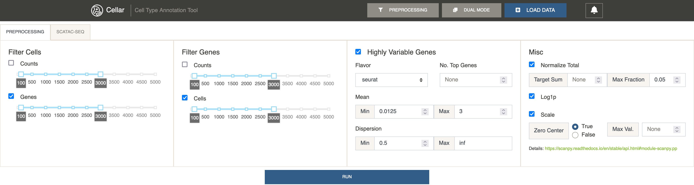

A notification saying "Finished preprocessing" should appear. We can now see
that the shape of the data has changed. The number of cells remained the same,
but we now only have 570 highly variable genes to work with.

Next, we reduce the data. To understand what method to use and when, please
refer to [Dimensionality Reduction](/docs/ui-components/sidebar/dimensionality-reduction).
Applying PCA, followed by UMAP for 2D embeddings has proven to be a good
combination when analyzing scRNA-seq data.

- Close the preprocessing and data panels if they are open. Under the
  dimensionality reduction panel, select PCA and UMAP and click `Run`.

    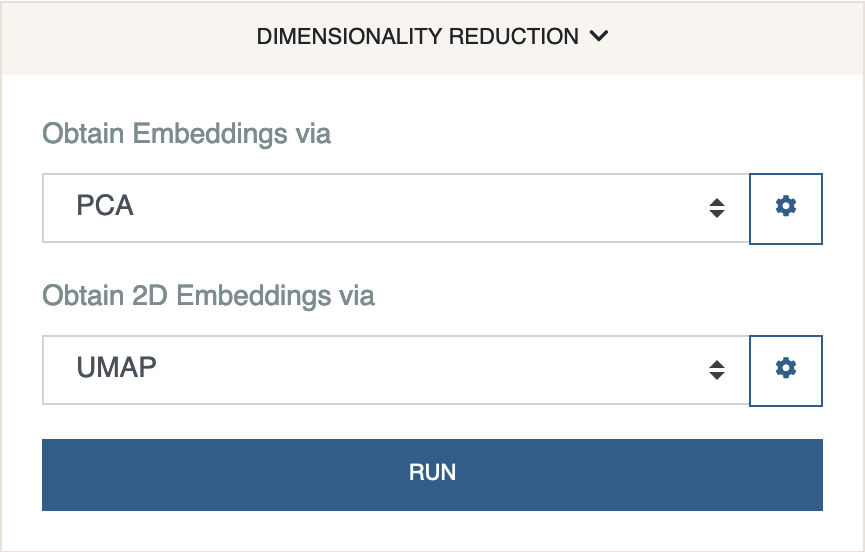

Once Cellar finishes processing, you should see a 2D representation of
your data in the form of a scatter plot.

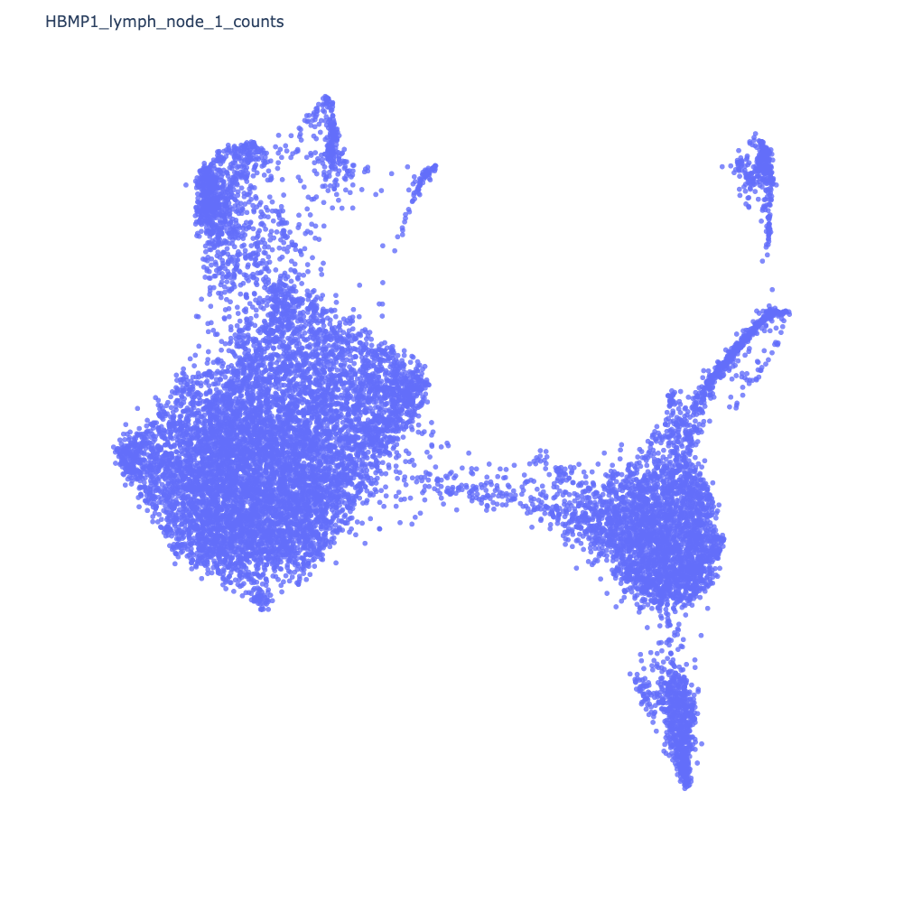

Next, we cluster the data. We will use Leiden clustering.

- Under the clustering panel, select Leiden and click `Run`.

    

This will color each cell by the cluster it has been assigned to.

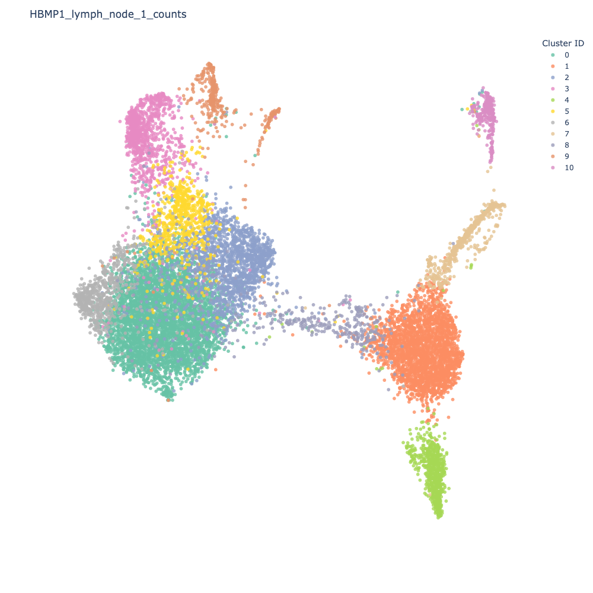

Let us identify some differentially expressed genes for Cluster 0
(emerald green).

- Under the DE analysis panel, select `Cluster 0` under the first dropdown
  menu and leave the second menu to `rest`. Click `Find DE Genes`.

    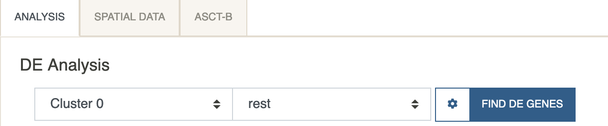

Shortly after, you should see a table of DE genes, sorted by log2fc.

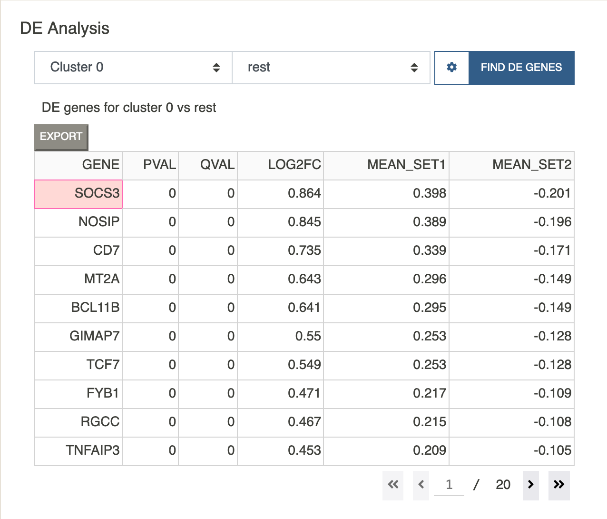

Clicking on any gene will paste that gene to the feature visualization
input box. Let us view the expression value of the top gene in the list `SOCS3`.

- Click on the `SOCS3` gene. You should see that gene show up under feature
  visualization. Next click `Plotting` and select `Plot Expression`.

    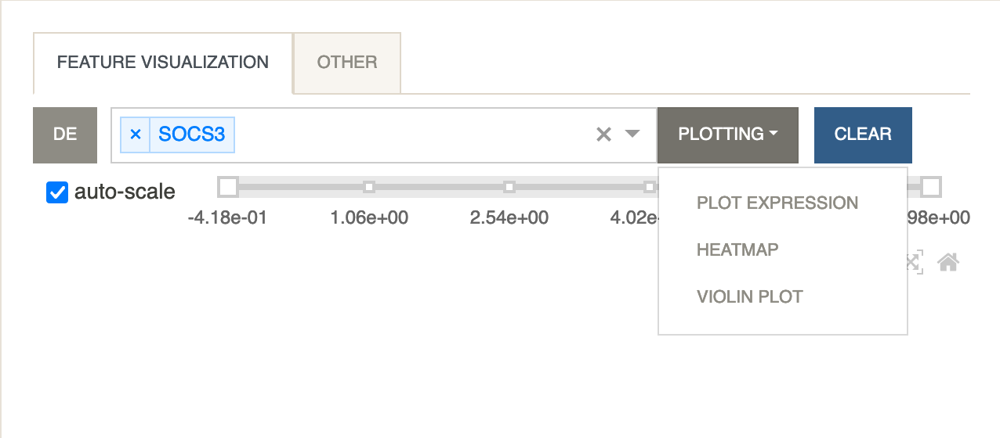

The scatter plot should update to show the expression levels of the gene as below.

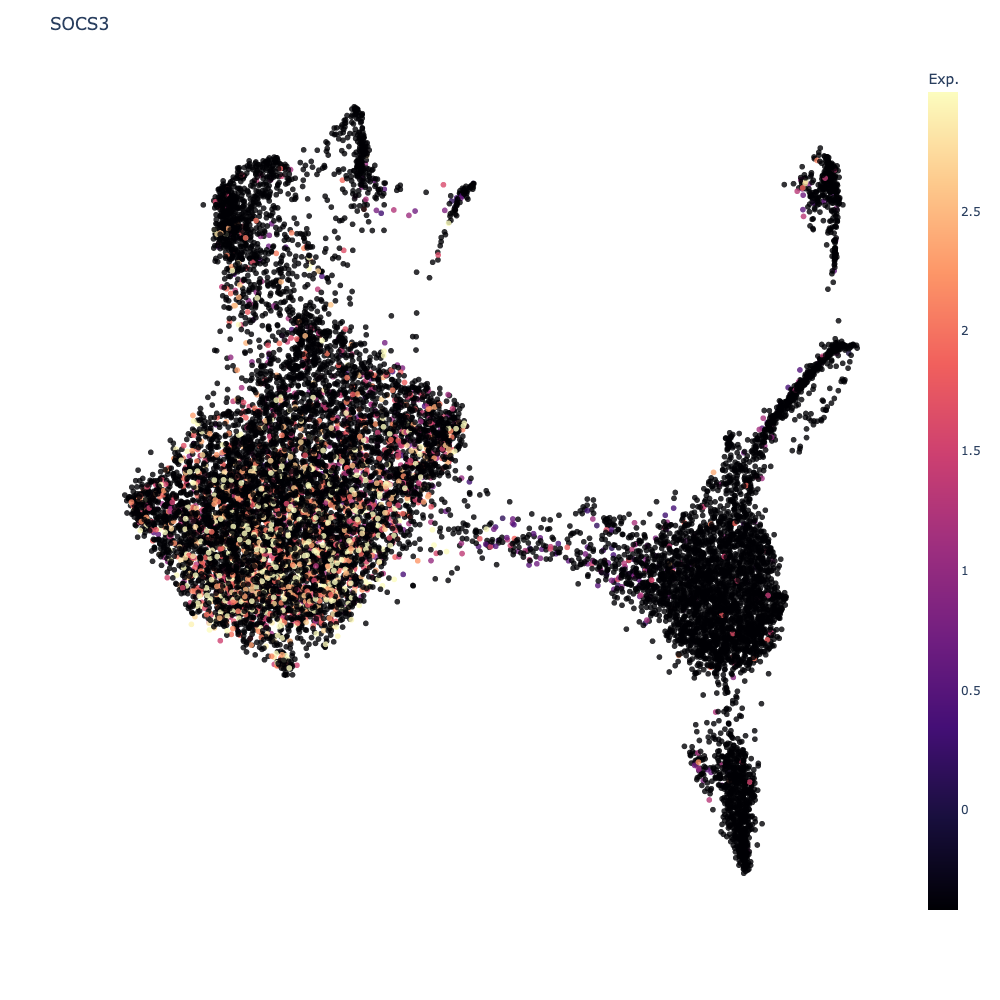

Let's now look at a heatmap of multiple genes and their average expression
levels for each cluster.

- Under `Feature Visualization` click `DE`. All 10 genes from the visible page
  will be parsed into the input box. Under `Plotting` select `Heatmap`.

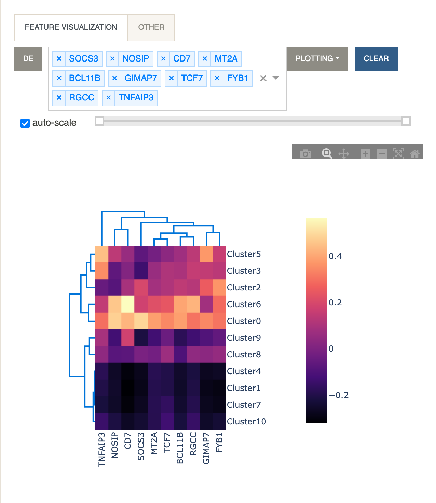

Next we take a look at some possible cell types by using a curated
cell type gene set that is part of Cellar.

- Under `Enrichment Analysis` click `Run`.

    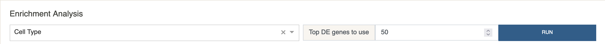

This will give us a table of possible cell type assignments for Cluster 0,
sorted by corrected p-value.

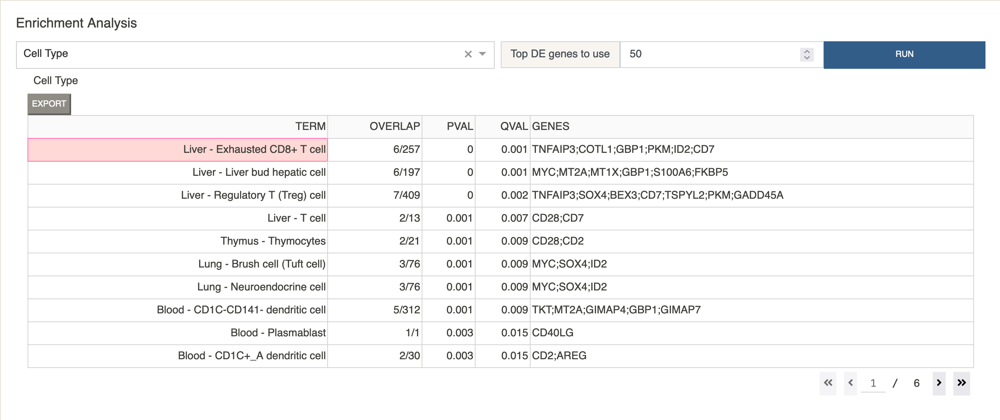

Let us annotate this cluster with the label "CD8+ T Cell".

- Under the `Annotations` panel select `Cluster 0`. Type "CD8+ T Cell" in
  the input box, and click "Store".

    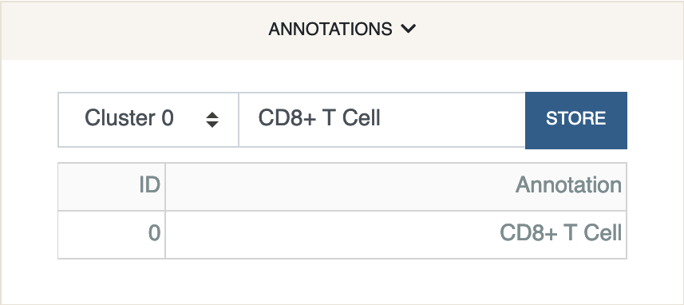

The annotation has been stored in the anndata file. We were very naive
about the assignment as we only looked at the top entry returned by
the analysis. In a real scenario, domain knowledge and further exploration
of DE and marker genes must be considered.

Once we are happy with our cell type assignments, we can export the session
file for later use.

- Under the `Session` panel click "Export Session". This will generate
  an `.h5ad` file for download.

    

