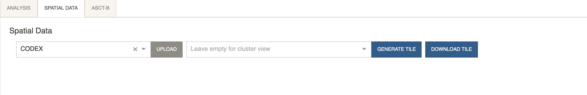
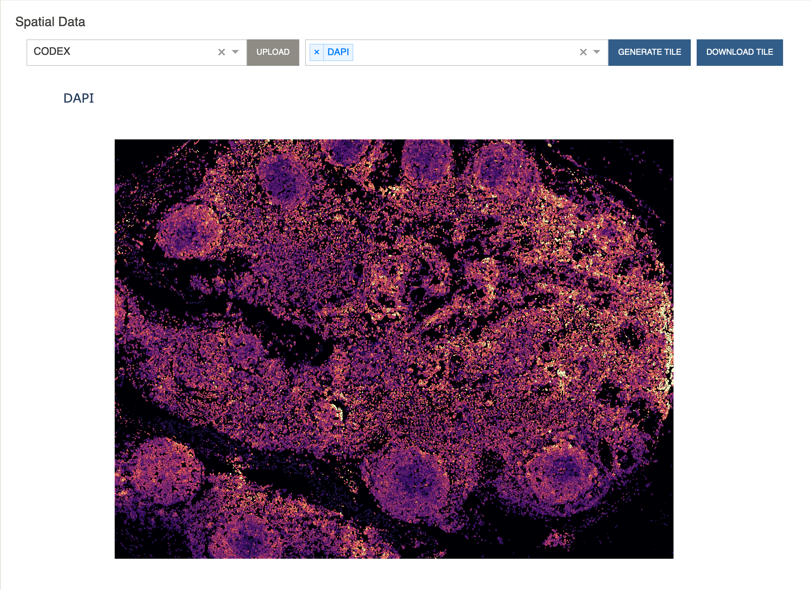
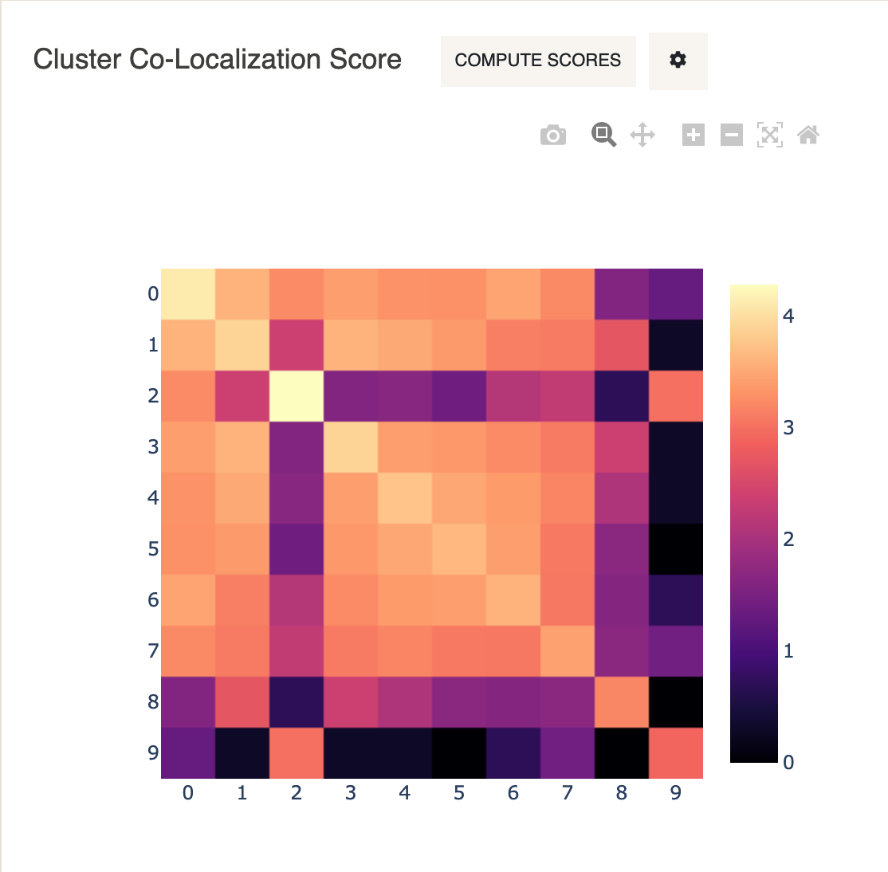

# Tutorial - Visualizing CODEX Spatial Tiles
{: .no_toc }

This tutorial describes how to visualize the spatial tile for any CODEX dataset
available in Cellar. A related video tutorial can be accessed
[here](https://www.youtube.com/watch?v=zG3j3DdqLUQ).
{: .fs-6 .fw-300 }

---

We will be analyzing a lymph node dataset, courtesy of the University of Florida and
[HuBMAP](https://portal.hubmapconsortium.org/browse/dataset/077f7862f6306055899374c7807a30c3).
This dataset can be found on Cellar under the name *CODEX_Florida_19-003-lymph-node-R2*.

- Expand the data panel by clicking `Load Data` and select
    *CODEX_Florida_19-003-lymph-node-R2* from the dropdown menu. Click `Load`.

    

You will note that the plot gets populated automatically.
After loading a dataset, Cellar will check if 2D embeddings or cluster
assignments are present in the file. In this case, we have already
reduced (PCA + UMAP) and clustered (Leiden) the lymph node dataset.
If you wish to recluster or run different dimensionality reduction methods,
you can follow the same steps as in the
[Basic Analysis Pipeline](/docs/tutorials/tutorial1) tutorial. We will head
straight for the spatial tile.

- Under the `Spatial Data` tab, select `CODEX` from the dropdown menu and click
  `Generate Tile`.

    

For your own uploaded CODEX data you may need to upload additional
files containing spatial coordinates for every cell. For details,
check the section on [Spatial Tiles](/docs/ui-components/spatial/tile).

Cellar will now read each cell's coordinates and attempt to color each
cell by the cluster assignments.

Hovering over cells will display that cell's cluster ID.

Additionally, you can choose to display the expression levels of a protein.

- Select `DAPI` or any other protein from the dropdown menu and click
  "Generate Tile".

We will also compute cluster co-localization scores to see which clusters
are close to each-other in the spatial tile.

- Under `Cluster Co-Localization Score` click `Compute Scores.`

One can notice from this heatmap, for example, that Cluster 2 and Cluster 9
are co-localized. Looking at the spatial tile above, we see that cells
belonging to Cluster 9 are indeed surrounded by cells belonging to Cluster 2
(lymphocytes of B lineage).