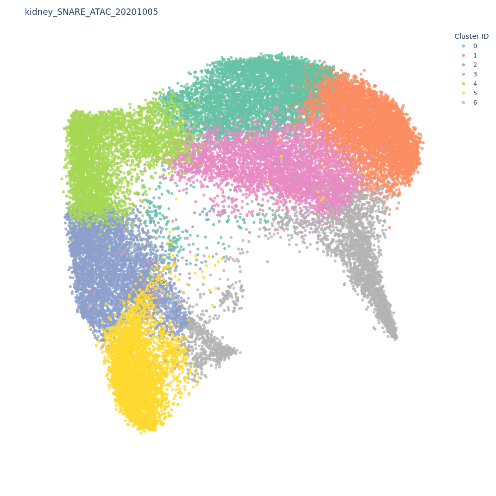
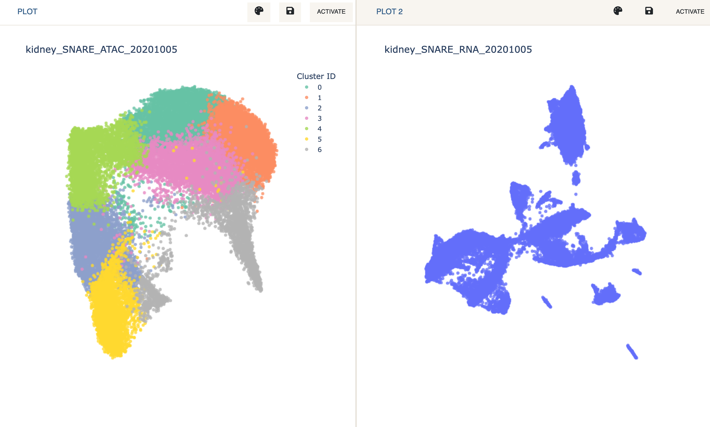
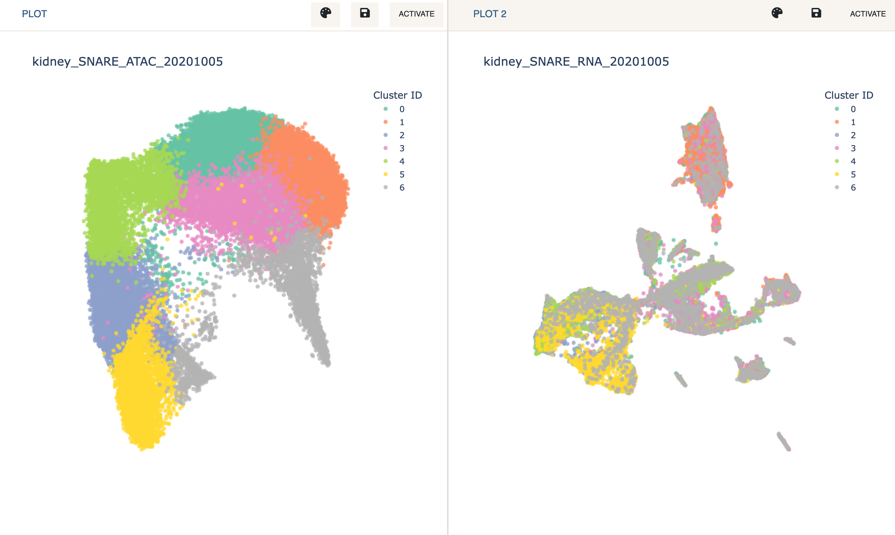

# Tutorial - Joint Analysis & Label Transfer
{: .no_toc }

This tutorial describes how to use the Dual Mode in Cellar and related
functionality such as Label Transfer. A video tutorial can be found
[here](https://www.youtube.com/watch?v=QBUXhFZrHec).
{: .fs-6 .fw-300 }

---

We will be analyzing a SNARE-seq dataset where the two modalities have
been split into separate AnnData objects. These datasets can be found on
Cellar under the names *kidney_SNARE_ATAC_20201005* for the chromatin
modality and *kidney_SNARE_RNA_20201005* for the expression modality.

- First load the chromatin data by selecting
    *kidney_SNARE_ATAC_20201005* from the dropdown menu. Click `Load`.

We can see at the top left corner of the app that this dataset contains
31,758 cells and 575,265 features (peaks). This high dimensionality
combined with the sparsity makes it very hard to use methods like PCA or UMAP
to reduce this data.
[*cisTopic*](https://www.nature.com/articles/s41592-019-0367-1) can be
a good alternative in this case. cisTopic
will find cis-regulatory topics by using a probabilistic model based on
[Latent Dirichlet allocation](https://en.wikipedia.org/wiki/Latent_Dirichlet_allocation),
which can be interpreted as a reduced version of the data. Running cisTopic on
500k features might take a long time (up to an hour). However, we have already
done this for you and you should already see a 2D representation
of the topics on the screen, clustered by Leiden.

Next, we enter Dual Mode and load the expression data on the 2nd plot.

- Click `Dual Mode` on the navigation bar. This will split the screen in two.
  Now `Activate` the empty plot that was just created and load
  *kidney_SNARE_RNA_20201005* just like you normally would.

- Reduce the dimensions of the expression data via PCA + UMAP.

We now wish to transfer labels from one plot to the other. This can be obtained
by going to the `Label Transfer` panel. Since cell IDs between the two datasets match,
we can use the `Cell ID Based` label transfer method.

NOTE: we are overloading the term "label transfer" as no real label
transfer is happening here. Actual integration methods include Scanpy Ingest
and SingleR. These methods can be used between two datasets that do not
necessarily come from the same experiment. The procedure is similar to what
follows.

- Under the `Label Transfer` tab in the `Clustering` panel, select
  `Cell ID based` and click `Run`.

We can now see the cluster assignments mapped from the first modality
to the second.

