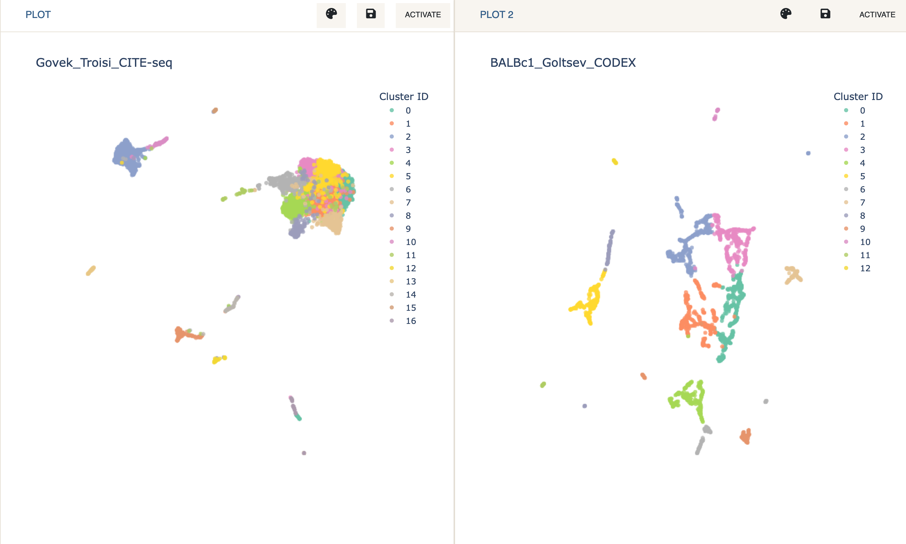
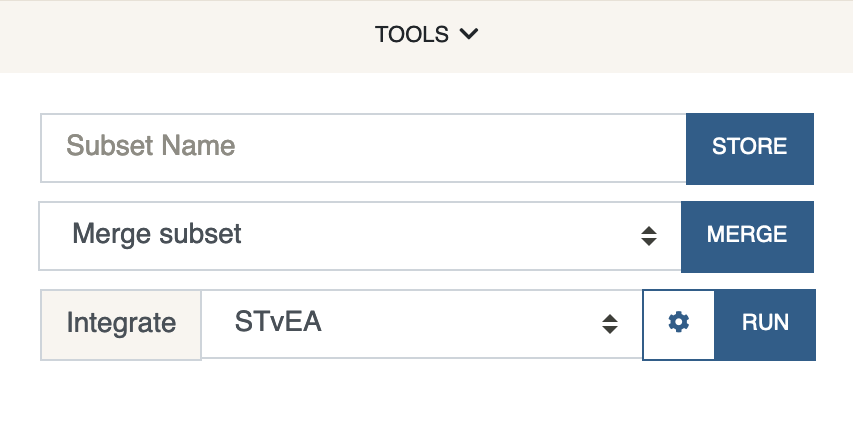
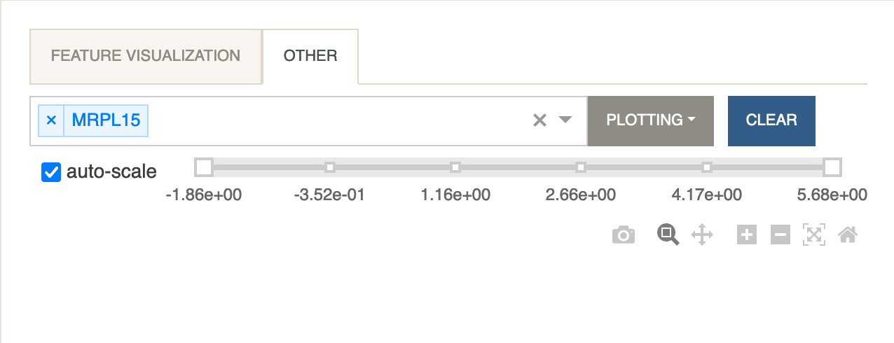
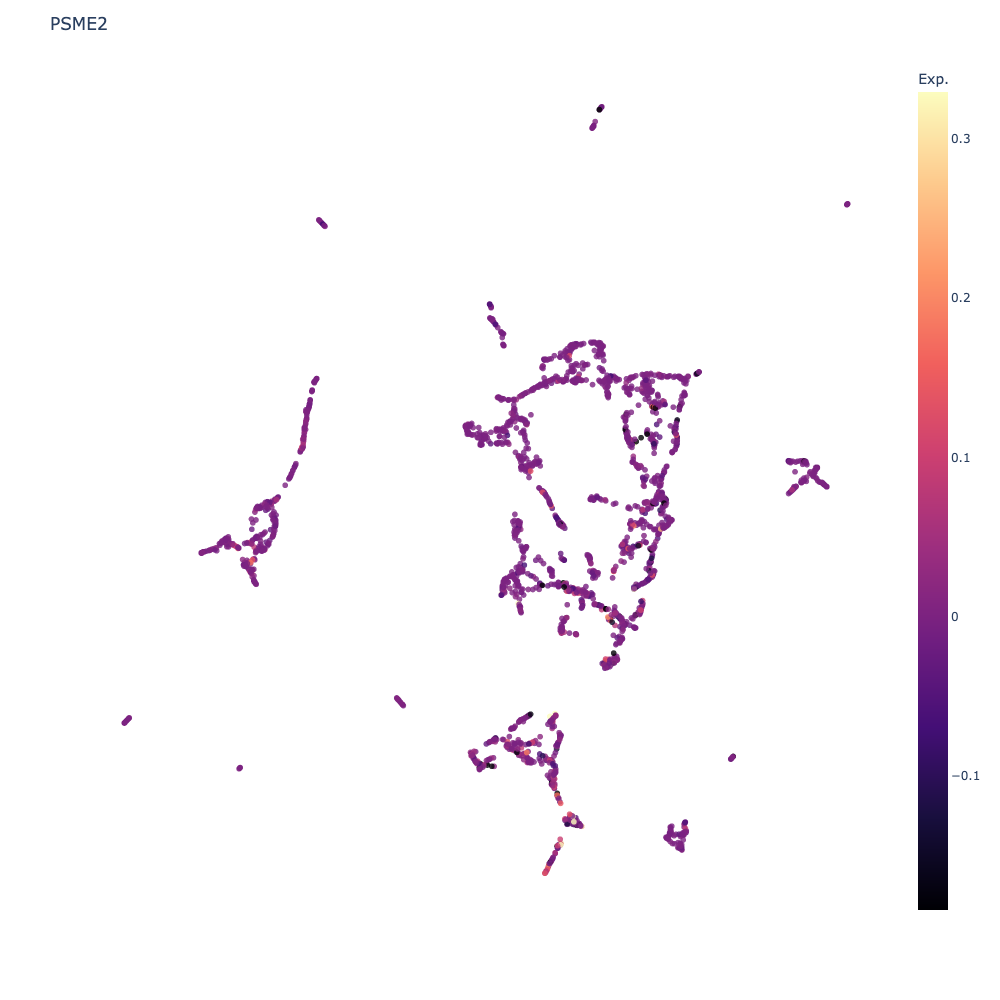

# Tutorial - Integration of CITE-seq and CODEX Protein Data
{: .no_toc }

This tutorial describes how to use [STvEA](https://www.science.org/doi/10.1126/sciadv.abc5464) to integrate CITE-seq and CODEX protein data.
{: .fs-6 .fw-300 }

Cellar supports CITE-seq data.
[CITE-seq](https://www.nature.com/articles/nmeth.4380) measures the epitome and
transcriptome levels at the single cell level. To upload a CITE-seq dataset to
Cellar, the data must be in AnnData format, with `adata.X` corresponding to
the mRNA expression matrix and `adata.obsm['proteins']` corresponding to
the protein expression matrix.
The names of the proteins must be stored under `adata.uns['proteins']`.

The expression levels of a protein can be visualized by selecting it from
the `Other Features` tab under the `Feature Visualization` panel.

The integration of CITE-seq and CODEX protein data is performed by using
the [STvEA](https://www.science.org/doi/10.1126/sciadv.abc5464)
package which uses an anchor correction method to map features between the two.

---

We will be using two datasets.
The CITE-seq dataset we use consists of [mRNA and protein expression
data from mice](https://www.biorxiv.org/content/10.1101/672501v1) and
the CODEX dataset profiles the [protein expression of tissue sections from
3 normal BALBc mice](https://www.cell.com/cell/fulltext/S0092-8674(18)30904-8).
To speed up calculations, we limit the analysis to only the first 3000 cells
of the CODEX dataset.

- Load the two datasets in Dual Mode just as described in the
  [Joint Analysis & Label Transfer](/docs/tutorials/tutorial3) tutorial
  (for CITE-seq load `Govek_Troisi_CITE-seq`, and for CODEX load
  `BALBc1_Goltsev_CODEX_3k`).

To perform the integration, first make sure the CODEX dataset is active.

- Under the `Tools` menu, select STvEA next to `Integrate` and click `Run`.

  

By default, we clean both datasets since STvEA works best
if the expression values are scaled to be in the (0, 1) interval.

Running STvEA might take a few minutes (fitting a negative binomial model
takes longer than a gaussian model). Once the integration is complete,
you can color the CODEX data by the expression level of any gene that
was mapped from CITE-seq by going to the `Other Features` tab.

