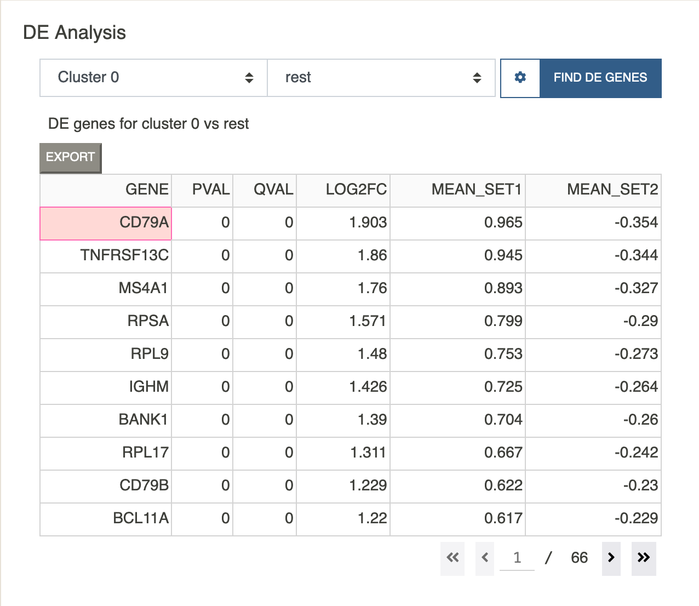

# DE Analysis
{: .no_toc }

DE analysis can be performed for any cluster or user-defined subset.
It is possible to run "one vs all" or "one vs one" tests. If
the second subset is set to `rest`, Cellar will find DE genes for Subset 1
against all the remaining cells. Otherwise, Cellar finds DE genes of
Subset 1 vs Subset 2.

To determine DE genes we use a t-test as implemented
in the [diffxpy](https://diffxpy.readthedocs.io/en/latest/)
package. All DE genes are sorted by log fold-change.
The corrected p-value threshold or fold-change threshold can
also be specified under the settings popover. If FC is set
to 0, then no fold-change filtering is applied. If the data has been
log-transformed during the preprocessing step, please make sure
"Is Data Logged" has been set to True, and False otherwise.

Clicking on any row of the DE table will paste the corresponding gene
into the feature visualization dropdown menu where it can be visualized
using one of the different plotting tools.

The DE table also shows the mean of the selected gene for both chosen
subsets. NOTE: this mean is computed on the normalized data (if
normalization was applied during the preprocessing step), therefore,
it may contain negative values. However, the data is scaled back
during the computation of fold-change.

