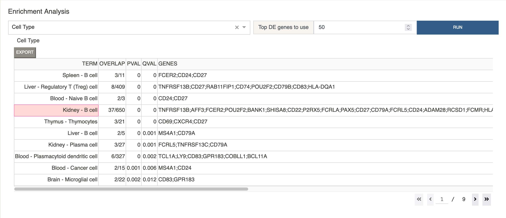

# Enrichment Analysis
{: .no_toc }

If the DE table is not empty, the top k genes can be used to
perform enrichment analysis. We use the
[GSEAPY](https://gseapy.readthedocs.io/en/latest/introduction.html)
Python package to perform the analysis.
Multiple gene sets from GSEAPY have been included,
as well as a cell type gene set curated by the developers. All entries
are sorted by q-value.

