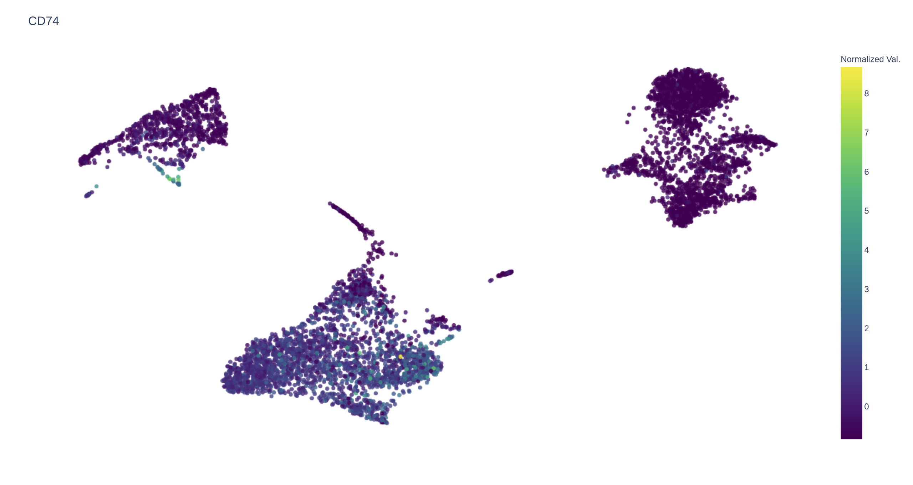
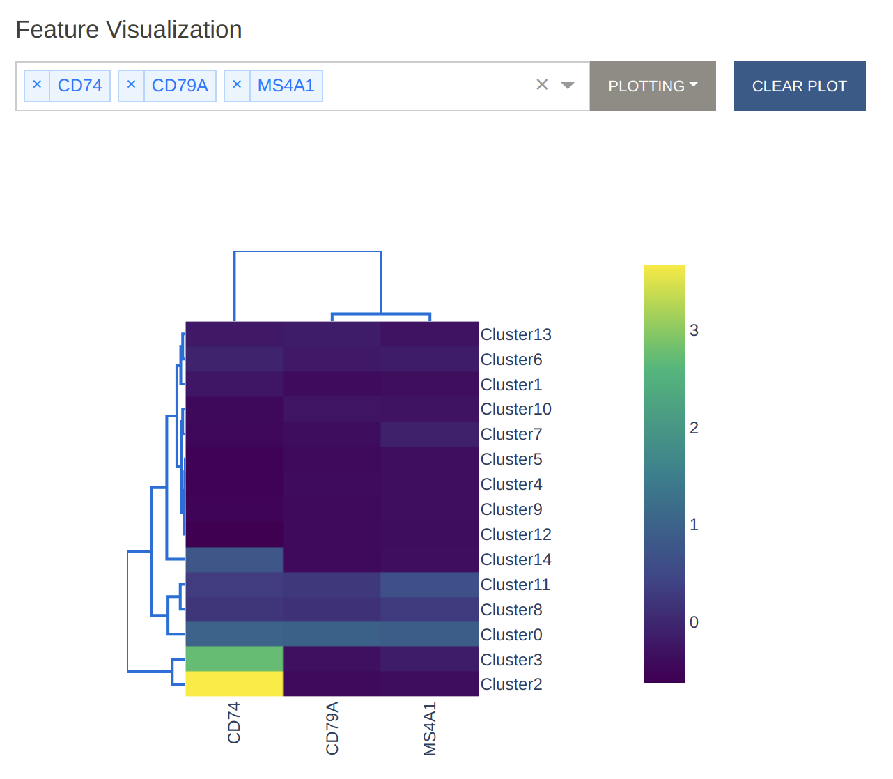
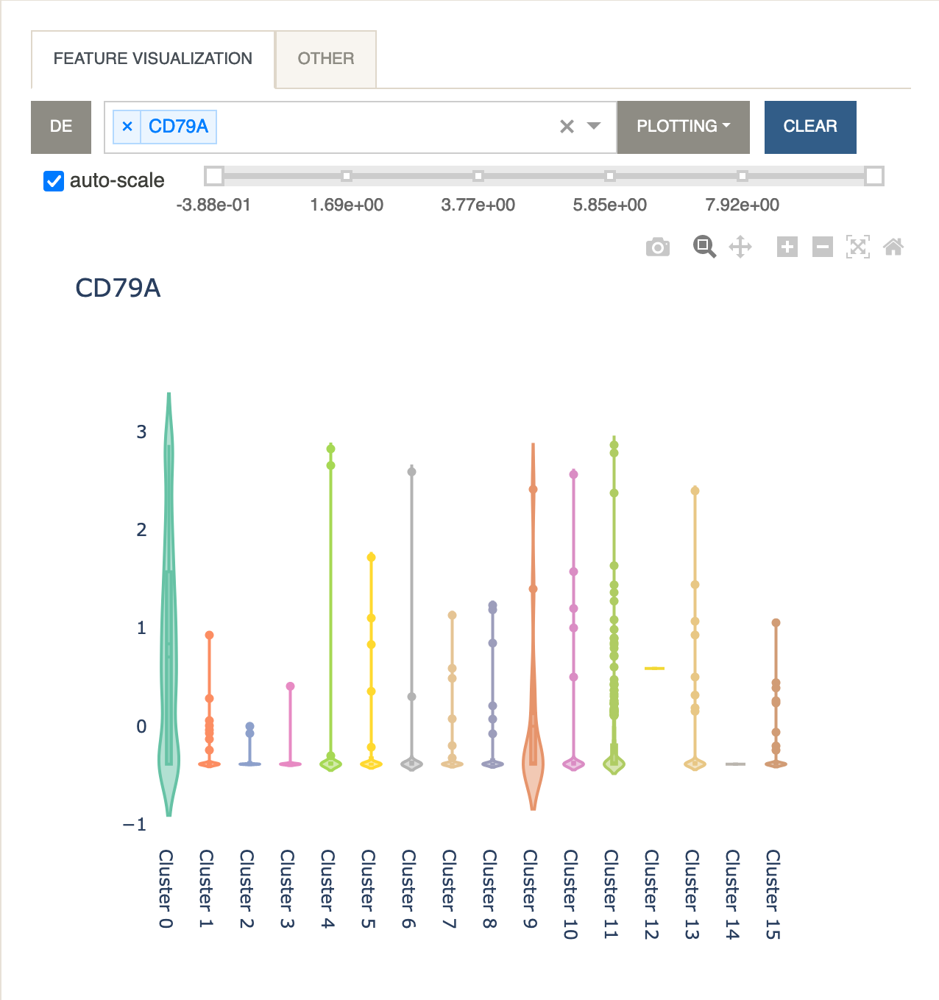

# Feature Visualization
{: .no_toc }

Viewing the activity levels of a gene or protein is important for determining
the cell type and function. In this panel we provide three different
visualization techniques that can be applied to any feature.

1. *Plot Expression*

    This will update the scatter plot colors to show the expression levels
    of the selected feature for every cell. To go back to cluster view, click
    the `Clear` button. If `auto-scale` is checked, Cellar will
    attempt to remove (more precisely, clip) any outlier values it finds
    so that very high or low values do not extend the colorscale unnecessarily.
    Unchecking `auto-scale` will enable a range slider for the selected
    feature which allows manual clipping of the gene range.

    When multiple genes are selected, a co-expression value is shown.
    To compute this co-expression value, we first scale each gene
    to the $$[0, 1]$$ range, and for every cell we take the minimum scaled
    expression value across all selected genes. Formally,
    if we let the expression matrix be
    $$M\in\mathbb{R}^{m\small\times n}$$, then given a cell
    $$i\in[m]$$, and a gene set $$G=\{g_1, \dots, g_r\}$$
    we compute the co-expression value of $$i$$ w.r.t. $$G$$ as
    $$c_i = \min_{j=1,\dots,r} \Big\{ \frac{M_{i, g_j} - v_{g_j}}{V_{g_j} - v_{g_j}} \Big\}$$
    where $$v_t = \min_j M_{j, t}$$ and $$V_t = \max_j M_{j, t}$$, i.e., the
    minimum and maximum expression values for gene $$t$$. Notice that
    $$0\leq c_i\leq 1$$. We apply this normalization to prevent biasing the
    co-expression towards any one gene. We choose to display the minimum
    as the minimum satisfies the property that
    $$\min\{0, p\}=\min\{p, 0\}=\min\{0, 0\}=0$$
    for $$p\geq 0$$. In all these three cases we would want the co-expression
    to be $$0$$.

    

2. *Heatmap*

    A heatmap is useful for visualizing the average expression levels of
    multiple genes across different clusters. Clicking the `DE` button
    will paste the visible page from the DE table into the dropdown menu
    so that multiple genes can be easily selected. Rows (clusters) and
    columns (genes) are linked using hierarchical clustering as implemented
    in the [Clustergram](https://dash.plotly.com/dash-bio/clustergram)
    function of dash-bio.

    

3. *Violin Plot*

    A violin plot is useful for visualizing the expression levels while
    also displaying the kernel density for every cluster. The same formula
    described under *Plot Expression* applies when multiple features are
    selected.

    

4. *Other*

    The same visualization tools can be applied to a different modality
    that has been included in the anndata file. For example, when working
    with CITE-seq data, it is possible to visualize protein expression data
    stored in `adata.obsm['proteins']` by using this panel.
    Similarly, one can visualize gene expression data stored in
    `adata.obsm['genes']`. The names for these features will be read
    from `adata.uns['proteins']` and `adata.uns['genes']`, respectively.

