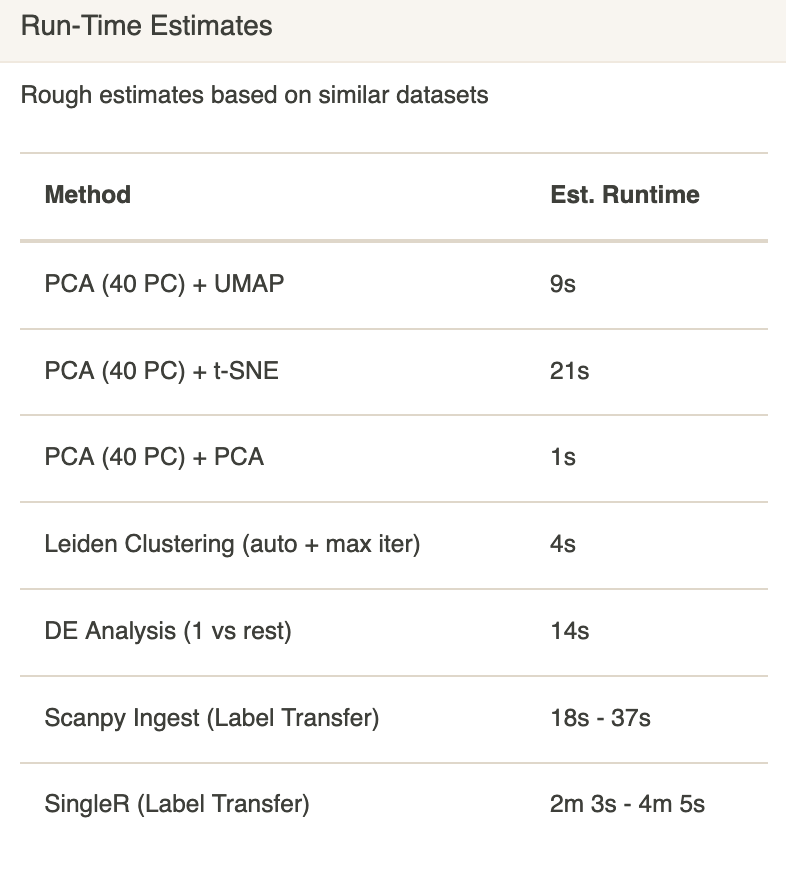

# Data Shape
{: .no_toc }

Upon loading a dataset, these values will update to reflect the number of
samples (cells) and number of features (genes, proteins). These values
may change after running preprocessing as some cells or noninformative genes
may be filtered. Keep an eye on these values to see if something went
wrong with the preprocessing step.

The bulb-shaped button contains rough runtime estimates for some
methods implemented in Cellar. We benchmarked these methods on our datasets
and fit simple curves to interpolate runtimes for similar datasets.

