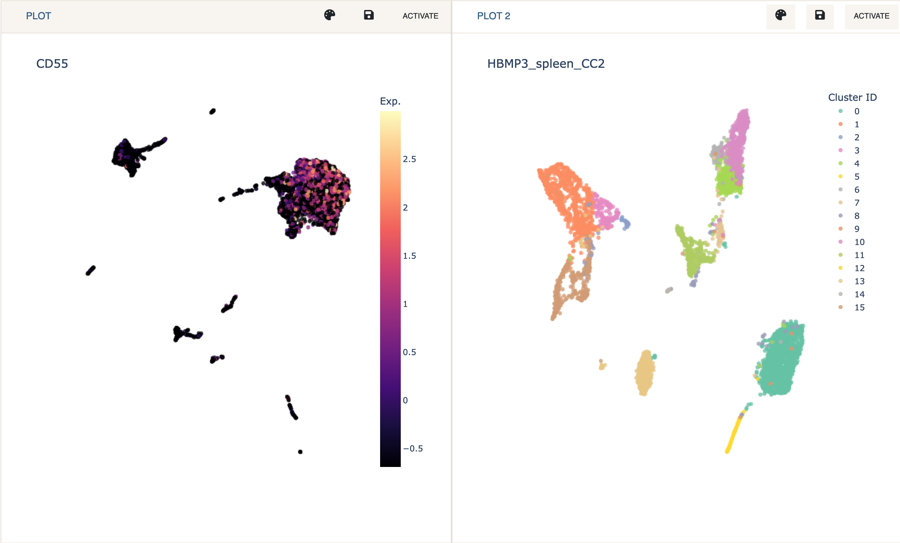
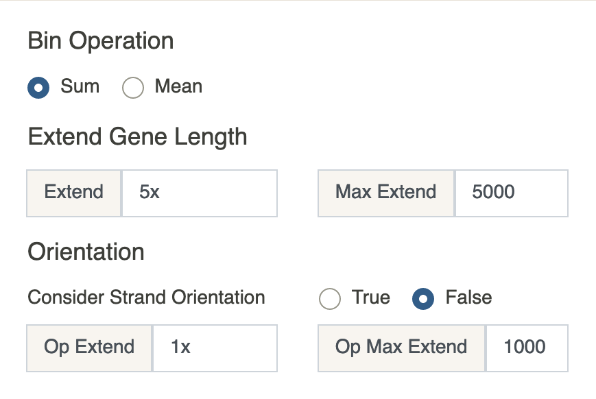

# Navigation bar
{: .no_toc }

The navigation bar contains two collapsible panels, one containing a list
of datasets and the other containing preprocessing tools. Moreover,
dual mode can also be activated from here.

1. *Load Data*

    Cellar contains several test datasets, most of which were generated by the
    **Human BioMolecular Atlas Program**
    ([HuBMAP](https://hubmapconsortium.org/)). These can be loaded and
    then downloaded using the `Export Session` functionality.
    Datasets are organized by data type, data center, and tissue.
    Data types include scRNA-seq, CODEX, scATAC-seq, SNARE-seq, etc,
    while tissues include lymph, spleen, thymus, kidney, heart, and more.
    Any uploaded datasets will appear first on the list.

    For a list of accepted file formats check [File Formats](/docs/file-formats).

    After loading a dataset, Cellar will check if 2D embeddings or cluster
    assignments are present in the file (only when uploading an AnnData object).
    If any are found, they will be used to automatically populate the plot and other
    relevant menus.

2. *Dual Mode*

    Dual Mode is used to analyze and visualize two datasets
    simultaneously. This can be particularly useful when analyzing
    [SNARE-seq](https://www.nature.com/articles/s41587-019-0290-0)
    chromatin and mRNA expression data, or when integrating two datasets
    (e.g., via label transfer).

    When in dual mode, only one dataset (plot) is active. This means that
    all of Cellar's functionality applies to that dataset only. This includes
    clustering, annotation, and analysis panels. A plot can be activated
    by clicking the `Activate` button at that plot's
    toolbar. Also, any label transfer functions assume the inactive dataset
    to be "reference" data, while the active dataset to be the one we wish
    to obtain labels for.

    Dual Mode can be exitted by clicking `Single View`. This will not
    clear the session for the other plot and hitting `Dual Mode` again will
    recover the analysis.

    

3. *Preprocessing*

    The preprocessing panel is split into two tabs. The first of these
    contains general preprocessing tools such as filtering cells or genes
    based on counts or normalizing each cell, while the second includes
    a special scATAC-seq preprocessing setup.

    Preprocessing
    {: .fs-5 .fw-500}

    The first panel uses the excellent preprocessing
    tools implemented in the [scanpy](https://scanpy.readthedocs.io/en/stable/)
    Python package. Our choice of preprocessing options is guided by this
    [tutorial](https://scanpy-tutorials.readthedocs.io/en/latest/pbmc3k.html).
    For a full description of the implemented preprocessing options consult scanpy's
    [API](https://scanpy.readthedocs.io/en/stable/api.html#module-scanpy.pp).
    Only the filters with checked boxes will be applied.

    NOTE: All Server Datasets have
    been preprocessed using the default options. Therefore, there is no need to
    run preprocessing for these datasets and doing so might raise an error.

    

    scATAC-seq
    {: .fs-5 .fw-500}

    To allow the analysis of scATAC-seq data, we provide an option to convert
    a cell $$\small\times$$ peak matrix to cell $$\small\times$$ gene.
    This allows scATAC-seq data to be analyzed via the existing tools
    build in Cellar, just like you normally would with scRNA-seq data.
    The conversion is based on the open chromatin accessibility associated
    with the nearby region of all genes (as listed in
    [GENCODE v35](https://www.gencodegenes.org/human/release_35.html)).  
    Formally, denote by $$P\in\mathbb{R}^{c\times p}$$ the
    cell $$\small\times$$ peak matrix and by $$G\in\mathbb{R}^{c\times n}$$ the
    cell $$\small\times$$ gene matrix to be created, where the total number of
    protein-coding genes in GENCODE v35 is $$n$$. Fix $$j\in[n]$$.   
    The first step is to extend the length of gene $$j$$. Let the
    $$j^{\text{th}}$$ gene location be the interval
    $$I_j=[\text{start}, \text{end}]$$ where $$\text{start}$$ and $$\text{end}$$
    are taken from GENCODE v35. We extend this interval by multiples of the
    gene length $$(\text{end} - \text{start})$$ or by a fixed number of base
    pairs. This value can be specified by the user in the
    `Extend` box. Any value that ends in `x` will
    be automatically considered a multiple of the gene length, otherwise
    it will be considered a fixed number of base pairs. Additionally, a
    `Max Extend` input box is provided which will limit
    the value of `Extend`. This is only useful when
    using a combination of gene length and a fixed number of base pairs.   
    Assume for convenience that `Extend`$$=5x$$ and
    `Max Extend`$$=5000$$. Then
    $$\text{start} \leftarrow \text{start} - \min(5\cdot(\text{end} -
    \text{start}), 5000)$$. The same value is added to $$\text{end}$$.
    If `Consider strand orientation` is set to `Yes`,
    you can specify different extension values to the end of the interval that
    corresponds to the downstream direction of the gene. This direction is
    determined by the `strand` key in the GENCODE v35 file.   
    Denote the updated interval by $$I_j^u$$. The next step is to find peaks
    (bins) whose range intersects with $$I_j^u$$. The values of these peaks
    are added or averaged (depending on the value of
    `Operation to apply to bins`) Formally, if we let
    $$K$$ denote peak ranges, then  
    $$G_{i, j} = \text{op}(\{P_{i, k}: \text{for all } k \text{ such that } K_k
    \cap I_j^u \neq \emptyset\})$$.
    The newly obtained cell $$\small\times$$ gene matrix undergoes basic
    preprocessing and filtering just like in the previous tab.

    

Running any preprocessing
will replace the raw data matrix with the preprocessed one.
If you wish to run preprocessing with different options, you need
to reload the dataset from the Dataset menu.
In case you export the session as an `.h5ad`
file from the Import/Export menu, you can still find the raw data under
`adata.raw`.

<!--  -->