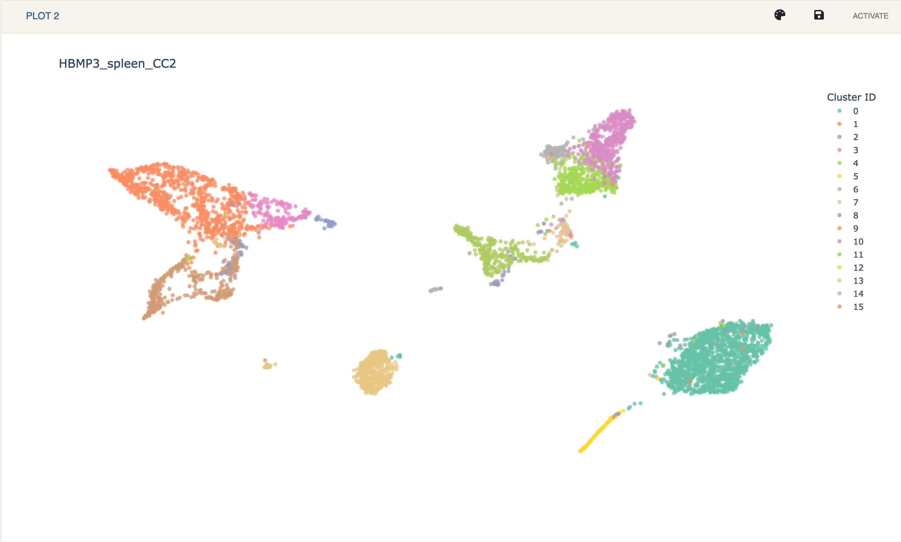

# Plot
{: .no_toc }

The plot is where you can see a 2 dimensional representation of your data.
If cluster assignments are available, they will be colored using different
qualitative colors. Hovering over a point will show that points coordaintes,
name, cluster ID, and annotation, if any. When viewing gene or protein
expression, if will also show the expression value.

The default color palette can be changed by clicking the palette shaped
button on the plot's toolbar where you will be allowed to enter
colors in hex format for each cluster.

A plot can be exported to different formats by clicking the save button.
Here you can also specify the width and height of the plot. Exporting to
an html file will download a dynamic plotly plot where you can interact
with the cells and see any values on hover.

When in `Dual Mode`, clicking `Activate` will make that plot active
and all Cellar related functionality will be applied to that plot only.

The plot title can be modified by clicking on it.

