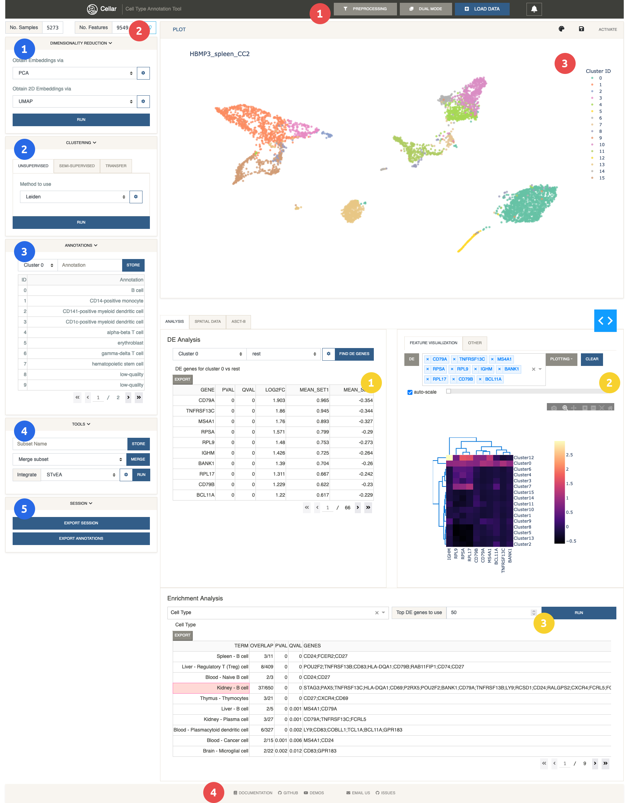
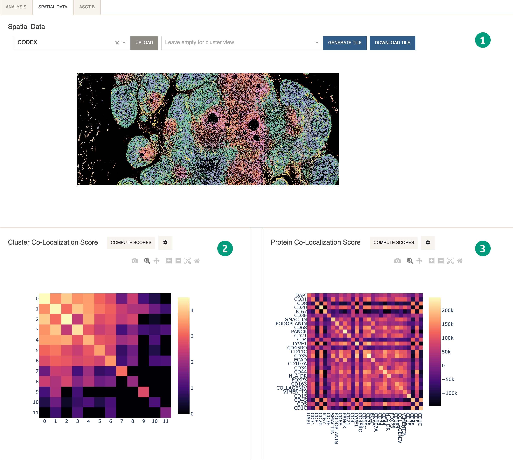

# Overview
{: .no_toc }

Here we provide a list of Cellar's main UI components. Each panel
will be described in detail in the following pages.
{: .fs-6 .fw-300 }

---

This is Cellar's main view during a typical workflow.

Sidebar
{: .label .label-blue}

1. [**Dimensionality Reduction**](sidebar/dimensionality-reduction)
2. [**Clustering**](sidebar/clustering)
3. [**Annotations**](sidebar/annotations)
4. [**Tools**](sidebar/tools)
5. [**Session**](sidebar/session)

Analysis
{: .label .label-yellow}

1. [**DE Analysis**](analysis/de)
2. [**Feature Visualization**](analysis/feature-visualization)
3. [**Enrichment Analysis**](analysis/enrich)

Other
{: .label .label-red}

1. [**Navigation Bar**](other/navigation-bar)
2. [**Data Shape**](other/data-shape)
3. [**Plot**](other/plot)
4. [**Footer**](other/footer)

---

Spatial Related
{: .label .label-green}

1. [**Spatial Tile**](spatial/tile)
2. [**Cluster Co-Localization Score**](spatial/coloc)
3. [**Protein Co-Localization Score**](spatial/coloc)
