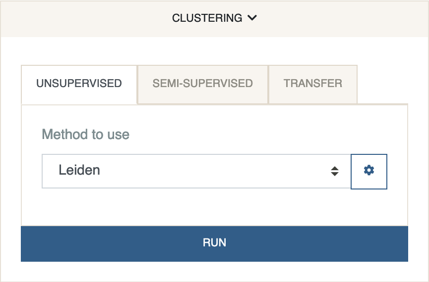

# Clustering
{: .no_toc }

The clustering panel contains three tabs. The first incorporates unsupervised
clustering algorithms which rely on no supervision or prior information
about the cluster assignments. The second tab includes semi-supervised
clustering algorithms which use partial information about the cluster labels.
Supervised label transfer algorithms are listed in the third tab and can be
used under Cellar's dual mode to transfer labels from one dataset to the other.

Clustering is an important step as it determines groupings of similar cells
that will be used for downstream analysis, such as the discovery of
differentially expressed genes or enrichment analysis. This is perhaps
the step that will require most experimenting. All clustering algorithms
use the embeddings obtained by the first method selected in the dimensionality
reduction panel.

1. *Unsupervised*

   The default method is
   [*Leiden*](https://www.nature.com/articles/s41598-019-41695-z) clustering.
   Leiden is a graph community detection algorithm which optimizes
   the measure of
   [modularity](https://en.wikipedia.org/wiki/Modularity_(networks)). Simply
   put, Leiden is looking for dense communities in a graph. Since
   most of the single cell data is not structured as a graph, an intermediate
   method is needed to transform a sample-by-feature matrix into one.
   A common approach is to add an edge between each sample (cell) and its
   neighbors (as determined by Euclidean distances). For small datasets,
   we compute the exact $$k$$ nearest neighbors in the reduced space and
   use them to construct an unweighted graph. For larger datasets (>5,000
   cells), we switch to an approximate nearest neighbors approach that is
   based on the [*faiss*](https://github.com/facebookresearch/faiss) package.
   Faiss greatly reduces the computation runtime at little cost in accuracy.
   This default behavior can be changed at anytime by expanding
   Leiden's settings and changing the `Graph Construction Method`.
   Leiden does not require prior knowledge about
   the number of clusters, however, this number is affected by the
   `resolution` parameter (default: $$1$$). Resolution controls the tradeoff
   between inter and intra cluster densities, with higher resolution
   resulting in more clusters. This is the most important hyperparameter
   to tune when running Leiden. For CODEX datasets, we obtained good results
   when the resolution was set between $$0.1$$ and $$0.3$$.

   Other algorithms include *KMeans*, *Spectral Clustering*, and *Agglomerative
   Clustering*. Unlike Leiden, for these three you need to specify the
   number of clusters in advance. To ease the tuning process, we allow the
   specification of multiple #clusters. This can be in the form of a list,
   e.g. $$[4, 8, 16]$$ will spawn three instances of the algorithm, but it
   can also be a range $$(4, 9, 1)$$ which will run the algorithm five times,
   one for each number between $$4$$ and $$8$$ (inclusive). The best
   cluster configuration is then determined by using the
   [*Silhouette Score*](https://en.wikipedia.org/wiki/Silhouette_(clustering)).

    *Uncertainty clustering* can only be run after labels have already been
    obtained by any of the other algorithms. Uncertainty clustering generates a
    new cluster with ID -1, for cells that have a high uncertainty
    score. The uncertainty score is computed according to the cells'
    distance from the cluster centroids in the reduced space.
    Re-clustering the newly generated uncertain cluster using
    Constrained Leiden oftens leads to better results. Intuitively,
    the improvements come from incorporating information about the
    cluster centers into the algorithm, which is not considered in vanilla
    Leiden.

2. *Semi-Supervised*

    A simple extension of the Leiden algorithm has been included in Cellar
    to allow re-clustering of the data while keeping certain clusters fixed.
    In other words, given a set of points $$\mathcal{A}$$ and a "fixed" subset
    $$\mathcal{F}\in\mathcal{A}$$, the cluster assignments for all the points
    in $$\mathcal{F}$$ will not change during the iterations of Leiden. This
    is particularly useful for re-distributing any poor quality clusters
    that were obtained due to noise in the process of label transfer, or even
    in combination with uncertainty clustering where low-scoring cells
    may need to be re-clustered but homogeneous clusters need to be kept
    intact. Clusters can be fixed by expanding the settings tab for
    Semi-Supervised Leiden and ticking the checkbox next to that cluster's
    or subset's name.

  3. *Label Transfer*

     Often it is desirable to perform annotation of cell types in a supervised
     manner where the supervision comes in the form of "reference data".
     This has the advantage of saving time, but also more importantly
     avoiding any human biases or errors during the annotatation process.
     Cellar implements two such methods for transferring labels in
     a supervised manner: 1) The
     [*Ingest*](https://scanpy.readthedocs.io/en/stable/generated/scanpy.tl.ingest.html)
     function from Scanpy, and 2)
     [*SingleR*](https://scanpy.readthedocs.io/en/stable/generated/scanpy.tl.ingest.html).
     Ingest works by first projecting the query and reference data into a shared
     PCA space and then using e nearest neighbors classifier to assign labels.
     SingleR, on the other hand, is a correlation based method that queries
     the reference dataset and iteratively removes low scoring cell types
     until only one remains. This procedure is applied to each cell individually
     so SingleR is typically slower than Ingest. For both algorithms, we only
     consider the features which are in common for the query and reference
     data, so please make sure the naming convention for the two is the same.

     NOTE: In Cellar, label transfer should be used under dual mode. The "active"
     dataset serves the role of a query dataset, while the "inactive" one
     will be used as a reference.

     *"Cell ID Based"* label transfer simply matches the cell barcodes between
     the two datasets and copies cluster assignments from one to the other.
     This is useful when analyzing two data modalities that were profiled
     from the same cells, such as in the case of SNARE-seq.
  

The scatter plot with the 2D embeddings will update to show cluster
assignments after this step is complete. Cluster numbering starts from $$0$$.
The color palette can be modified by clicking the palette shaped button
at the plot's toolbar.

The cluster assignments are stored under `adata.obs['labels']`. The
neighbors graph is stored as a sparse matrix under `adata.obsp['neighs']`.
Related settings are stored under `adata.uns['labels']`.

