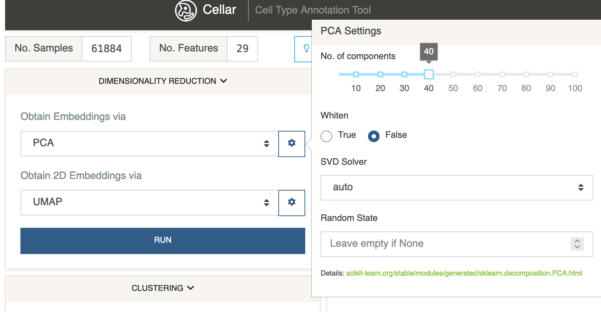

# Dimensionality Reduction
{: .no_toc }

This panel is split into two select menus which contain almost the same
set of dimensionality reduction methods. Cellar first reduces the data
to a number of dimensions that is greater than 2. The goal is to denoise
the data and obtain an embedding matrix that is more efficient to work
with from a computational point of view. These embeddings are then further
reduced to 2 dimensions for visualization purposes by using another
(possible the same) method. By default, Cellar (but also other packages;
e.g., [Seurat](https://satijalab.org/seurat/articles/pbmc3k_tutorial.html),
[Scanpy](https://scanpy-tutorials.readthedocs.io/en/latest/pbmc3k.html)),
perform this two-step reduction by first applying Principal Component
Analysis ([*PCA*](https://en.wikipedia.org/wiki/Principal_component_analysis))
followed by Uniform Manifold Approximation and Projection
([*UMAP*](https://umap-learn.readthedocs.io/en/latest/)).

1. *Obtain Embeddings*

   The default method is PCA with 40 principal components. PCA scales the
   data before computing the SVD, therefore, it cannot work with sparse
   matrices. If your data is sparse, *Truncated SVD* is a good alternative
   or even UMAP. PCA and Truncated SVD are typically the fastest performing
   methods from the list, with UMAP and *Diffusion Maps* being slower.
   [*cisTopic*](https://www.nature.com/articles/s41592-019-0367-1) can be
   used when working with scATAC-seq data in cell-by-peak format. cisTopic
   will find cis-regulatory topics by using a probabilistic model based on
   [Latent Dirichlet allocation](https://en.wikipedia.org/wiki/Latent_Dirichlet_allocation),
   which can be interpreted as a reduced version of the data. This is quite
   useful in the case of scATAC-seq, since the number of peaks is
   typically a few hundred thousand and the data is very sparse which
   greatly harms the performance of other methods like PCA.

   When working with CODEX data, it is common for the number of channels
   (proteins) profiled to be smaller than 40. In this case it may be necessary
   to reduce the default number of components from 40 to a smaller value.
   This can be achieved by clicking the gear-shaped button next to the
   menu which will expand various hyperparameters and settings related
   to the selected method.

    

2. *Obtain 2D Embeddings*

    This list is almost the same as the previous one, with the addition
    of [*t-SNE*](https://lvdmaaten.github.io/tsne/). Typically UMAP gives
    the best results, with t-SNE being a close match. However, the time
    complexity of running t-SNE is quadratic which makes it much slower
    than UMAP. Furthermore, UMAP preserves more of the global structure
    than t-SNE, hence, it is the method we recommend for most cases. PCA
    can also be considered when a faster method than UMAP is desired. For
    some rough runtime estimates consult the bulb-shaped button next to
    the dataset's shape.

    [Here](https://pair-code.github.io/understanding-umap/) is a nice tool
    you can use to gain a better understanding of how UMAP works.

A scatter plot of the 2D embeddings is shown after the dimensionality
reduction step is complete. By default, all cells belong to a single
cluster (ID 0).

The embeddings are stored in the anndata object under `adata.obsm['x_emb']`,
while the 2D embeddings are stored under `adata.obsm['x_emb_2d']`.
Relevant settings are stored under `adata.uns['x_emb']`
and `adata.uns['x_emb_2d']`.

