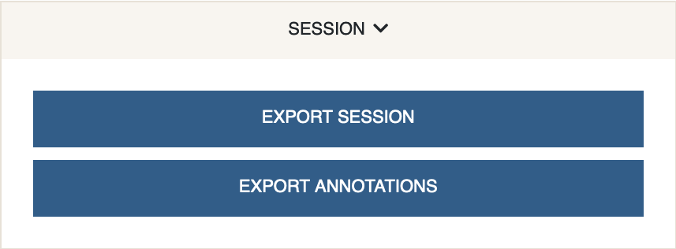

# Session
{: .no_toc }

Exporting a Cellar session will generate a compressed `.h5ad` file with
all the data and other annotations. This file can be uploaded back to Cellar
to continue the analysis or shared with others.

NOTE: when using the Cellar interface, a session will die if idle for 1 hour.
Please save your progress frequently to avoid data loss, or use a local
installation of Cellar.

If only the annotations are desired, `Export Annotations` will generate
a `.csv` file with the cell barcodes and any cluster assignments / cell types.

