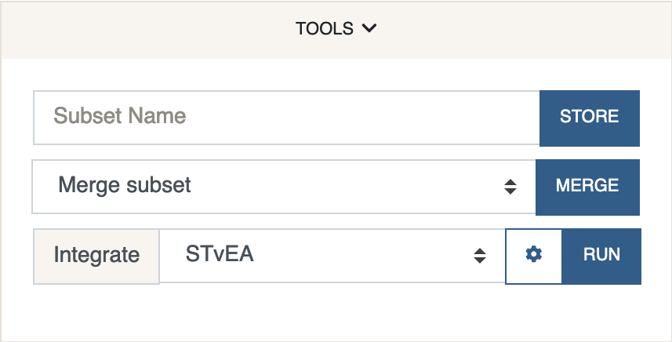
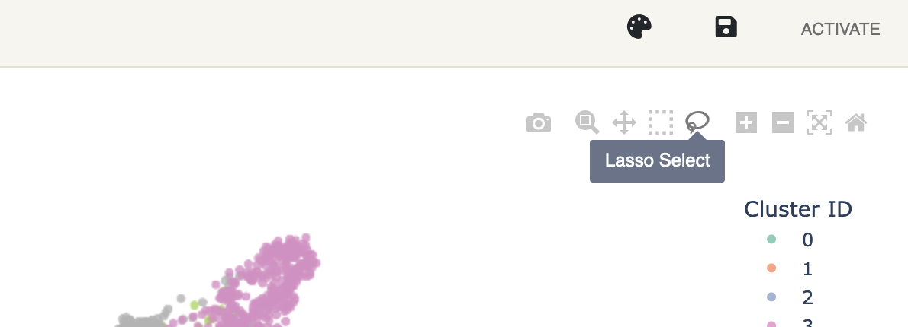

# Tools
{: .no_toc }

This panel consists of general tools. Currently it is only being used
to define new subsets or merge existing ones, and for performing STvEA
data integration between CITE-seq and CODEX protein data.

1. *Store Subset*

    To store a subset, a group of cells must be selected from the plot first.
    This can be done using the *lasso tool* that is active by default, but
    can also be switched to anytime in the plot's toolbox.
    
    Clicking and dragging your mouse while the lasso tool is active
    will select and highlight a group of cells which can then be given
    a name tag. Double clicking on the plot will reset the selection.

2. *Merge Subset*

    Any subset of cells as defined previously can be merged to form a new
    cluster. The new cluster will automatically be assigned an ID that is
    greater than all the cluster IDs before the merge.

3. *Integrate*

    Currently only implements
    [*STvEA*](https://www.science.org/doi/10.1126/sciadv.abc5464). STvEA
    can be used to integrate protein data from CITE-seq and CODEX. More
    precisely, it is used to map gene expression data from CITE-seq to CODEX.
    For this method to work, the CITE-seq anndata object must contain
    protein expression data stored under `adata.obsm['proteins']` while
    the main matrix `adata.X` should hold the gene expression
    counterpart. Protein names should be stored under `adata.uns['proteins']`
    and they must match CODEX protein names stored in `adata.var_names`.
    Running STvEA will add the mapped gene expression values under
    `adata.obsm['genes']` in the CODEX anndata file. These genes can be
    selected for visualization under "Other" Features in the Analysis panel.

    STvEA works best if the protein expression levels are contained in the
    (0, 1) interval, so we recommend having the cleaning settings set to
    True.

Subsets are stored under `adata.uns['subsets']`.