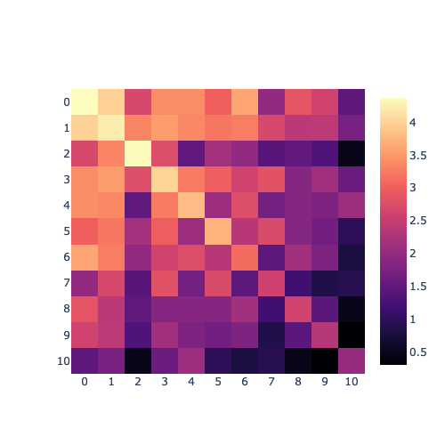
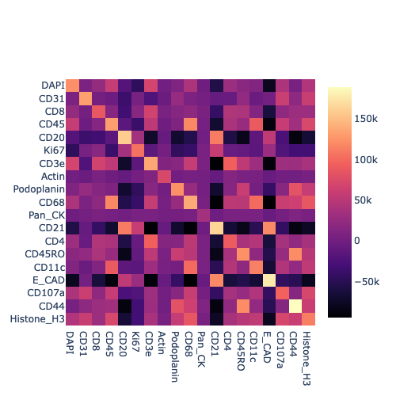

# Co-Localization Scores
{: .no_toc }

Currently, Cellar also supports cluster and protein co-localization scores
which are computed via the
[adjacency score](https://github.com/CamaraLab/AdjacencyScore).
These scores are shown as heatmaps and describe how well two clusters
or proteins are co-localized in the spatial tile.
Gene co-localization for Visium 10X spatial data is not currently supported.

We first construct a neighbors graph by using the spatial coordinates
of each cell, and then feed this graph to the STvEA package to compute
the adjacency score.

## Cluster Co-Localization
{: .no_toc }

## Protein Co-Localization
{: .no_toc }

