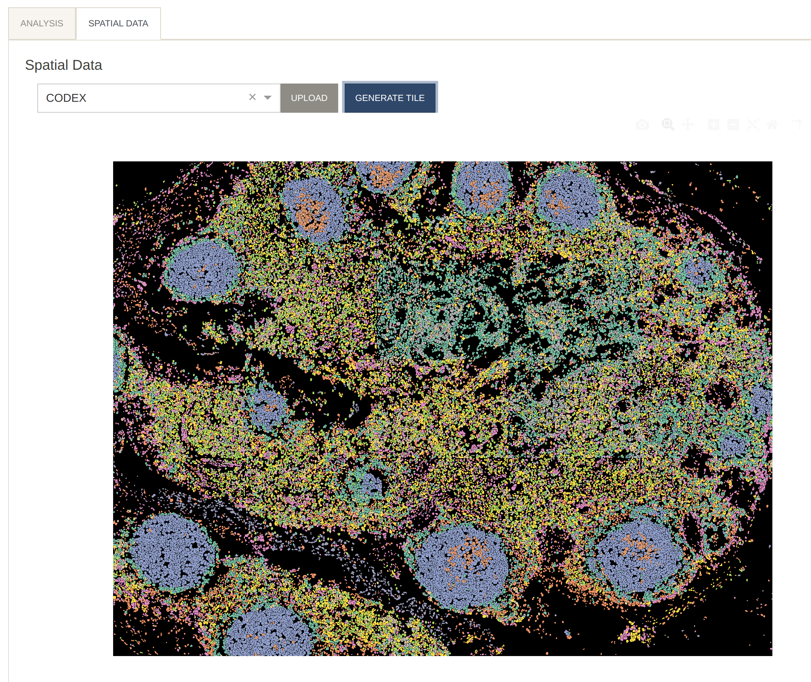
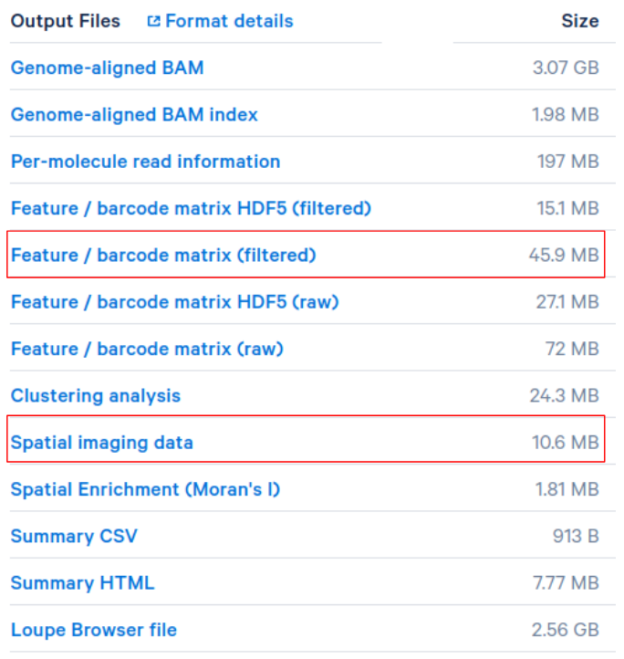
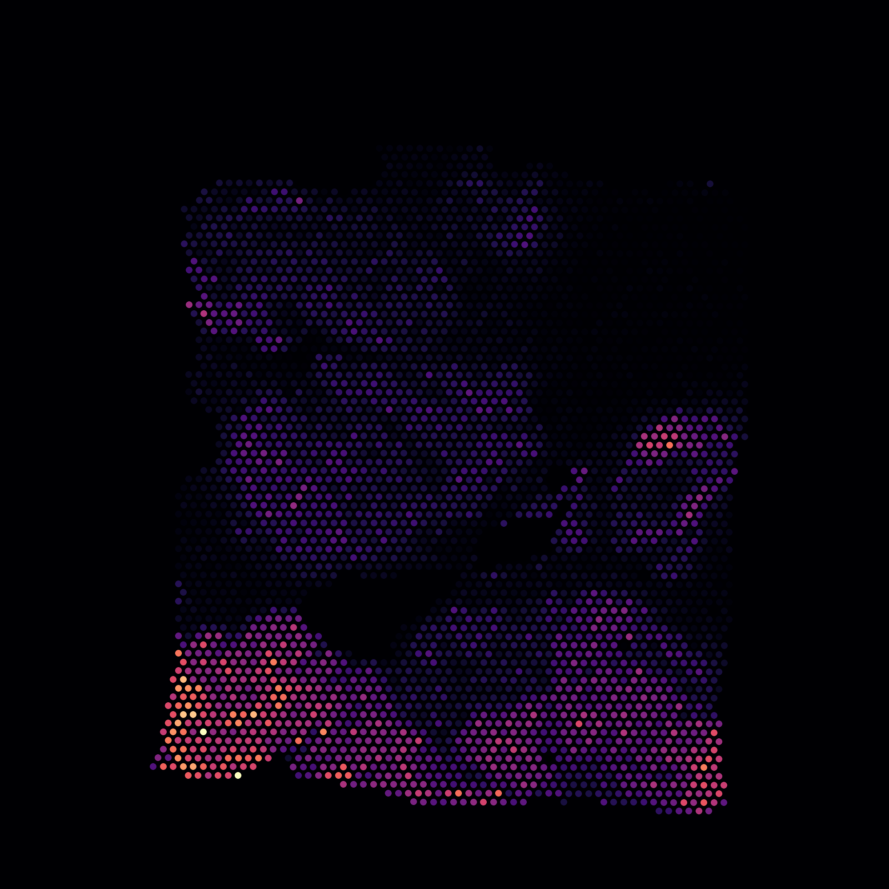

# Spatial Tile
{: .no_toc }

Currently we support CODEX and Visium 10x spatial technologies.

1. *CODEX*

    For CODEX we accept image data in three different ways.

    1. **x, y coordinates**

        The simplest representation consists of $$x$$ and $$y$$ coordinates
        corresponding to cell centers. This info should be provided in the
        anndata file under `adata.obs['x']` and `adata.obs['y']`. The cells
        will be visualized as dots.

        See an [example file](https://drive.google.com/file/d/17DaPpa4AJOaXPyoQtGl2ufYtbbiJZq8C/view?usp=sharing).

    2. **Spatial tile**

        A single channel image with pixel values representing cell membership
        can also be provided under `adata.uns['spatial_idx']`. The tile can
        have any shape (width, height). Pixel $$(i, j)$$ should be set to
        the index of a cell in adata (from 0 to the number of cells minus 1).
        A pixel value of -1 implies an empty location,
        and a value of -2 implies cell boundary (optional).

        [Example file](https://drive.google.com/file/d/1i6Td4WSjnuqG7ByYuyGG6Rv7qHtqYj64/view?usp=sharing).

    3. **cytokit**

        Lastly, we accept output produced by [cytokit](https://github.com/hammerlab/cytokit).
        You will need the following:

        * **Segmented images**

            These are `.tif` files named
            `R001_X00\*_Y00\*.tif` where the asterix
            character specifies the x and y coordinates of the tile
            (starting from 1). These images should have shape
            (z-planes, 4, height, width) where the 4 axis show:

            1. the cell segmentations filled,
            2. nucleus segmentation filled,
            3. cell segmentation outlines,
            4. nucleus segmentation outlines

            Each pixel in these segmented images
            will either have value 0, denoting no cell,
            or the value of the cell ID.

        * **A `data.csv` file**

            This file contains information output from Cytokit. Each row
            represents a cell, and the column `rid` gives the cell index
            in the `.h5ad` file.
            The column `id` gives the cell ID for that specific tile. The column `z`
            gives which z-plane in which that particular tile has the best focus,
            and columns `'tile_x'` and `'tile_y'` give the coordinates of the tile
            for that cell.

            A folder named `images` containing the tiff files and the `data.csv` file
            need to be compressed into a `.tar.gz`
            file and uploaded to Cellar in the spatial panel.

            [Here](https://drive.google.com/file/d/1flajE4b11j6gWC03PsOuU7CUUgC45l0p/view?usp=sharing)
            is an example `tar.gz` file that corresponds to *CODEX_Florida_19-003-lymph-node-R2*
            in Cellar.

    Generating the tile will color each cell by its cluster.

    

    Furthermore, tiles can also be colored by protein expression

    

2. *Visium 10x Spatial Transcriptomics*

    For 10X spatial data, simply upload the spatial related files
    generated by [spaceranger](https://support.10xgenomics.com/spatial-gene-expression/software/pipelines/latest/output/images).
    For example, for this [Adult Mouse Brain (FFPE)](https://www.10xgenomics.com/resources/datasets/adult-mouse-brain-ffpe-1-standard-1-3-0) dataset, download the "Spatial imaging data"
    and upload it in the `Spatial Data` panel.

    

    There is no need to upload any spatial image data
    for the `10x_breast_cancer_w_image` dataset found on our web server.

    Note that "Feature / barcode matrix (filtered)" gene expression files
    can be uploaded to Cellar in the `Load Data` panel directly.

    

    Also colored by gene expression

    

